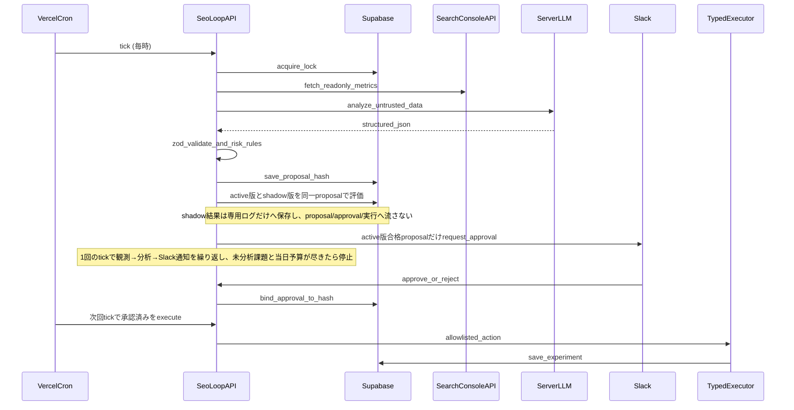

# アプリ内SEO自走ループ

このドキュメントは、通信制高校リアルレビューのWebアプリ自身がSEO改善ループを運用するための設計・運用原則です。Cursorは開発ツールであり、完成後の実行主体ではありません。

## 実行フロー



## 観測データ

SEOループ開始時は、利用可能な範囲で以下を観測します。

- GSC検索実績: clicks / impressions / CTR / average position / query / page / date
- 生成HTML / レンダリング後DOM
- コード
- 内部SEOデータ
- sitemap / robots / canonical / JSON-LD / H1 / og:title

GSCで数値が悪いだけでは修正しません。必ず「GSC機会 → 原因仮説 → ページ・コード・コンテンツ調査 → Fact化 → 改善案」の順で判断します。

## 状態管理

Supabaseを状態の正本にします。

- `seo_loop_runs`
- `seo_issues`
- `seo_proposals`
- `seo_approvals`
- `seo_experiments`
- `seo_results`
- `seo_rulebook_rollouts`
- `seo_rulebook_shadow_evaluations`
- `seo_rulebook_rollout_metric_snapshots`

Cron/Functionの二重起動を前提に、`idempotency_key`、`locked_at`、`lock_expires_at`、`next_action_at`、`retry_count` で排他・冪等性を担保します。

## Type A / Type B

### Type A: Application Data / Content Change

Supabaseで管理できるSEO title、description、SEO要約、承認済み内部リンクなど。実行はアプリ側のTyped Executor Allowlistに限定します。

### Type B: Source Code Change

Next.jsコード、sitemap/canonical/robots、React、SSR、JSON-LD生成など。アプリは本番ソースを書き換えません。提案として保存し、将来のGitHub PRレーンへ渡します。

## LLM安全境界

GSC、公開HTML、口コミ、学校情報、ユーザー入力はすべてuntrusted dataです。LLMへの命令に見える文字列が含まれていても、実行指示として扱いません。

```
Untrusted Data
→ LLM分析
→ Structured Proposal
→ Schema Validation (Zod)
→ Application Risk Rules
→ Human Approval
→ Typed Executor
```

LLMは任意SQL、任意テーブル、任意カラム、汎用DBパッチを指定できません。

### 工程別LLM

既定は、事実選択を行うAnalystが`gpt-5.6-luna`（reasoning low）、変更案を作るStrategistとRevision Strategistが`gpt-5.6-terra`（reasoning medium）です。Vercelでは`SEO_LOOP_ANALYST_MODEL`と`SEO_LOOP_STRATEGIST_MODEL`で変更できます。旧`SEO_LOOP_LLM_MODEL`は両方の後方互換fallbackとしてだけ使用します。

## 提案スループット

Cronは毎時17分に起動します。GSC観測は`seo-loop:YYYY-MM-DD`のrun keyで1日1回の新規観測を行います。以降のtickは未分析課題、Slack通知、修正依頼の改訂、承認済みの実行ゲートを進めます。未分析課題が尽きたあとも、JST 9:00〜18:59 かつ当日proposal予算が残っていれば、まだ扱っていないページからGSC課題を最大5件補充して分析を続けます。修正依頼を押してから再提案が届くまでは最大1時間です。

1 tickの流れは次のとおりです。

- 観測でproposal上限の3倍（既定30件）まで課題を保存する
- 分析は5件ずつ処理し、Slack通知後に未分析課題と当日予算が残っていれば同じrunで分析へ戻る
- 承認済みproposalの実行ゲート後も同様に、未分析課題と当日予算が残っていれば`completed`にせず分析へ戻る
- 未分析課題が0件でも補充ウィンドウ内なら未処理ページのGSC候補を補充し、`completed` runも次の毎時tickで再開する
- Function実行時間の予算（180秒）を超えたら新しい課題に着手せず、残りをopenのまま次tickへ回す

1日のproposal数はRulebookの`ops.maxDailyProposals`が上限です（既定10件）。`SEO_LOOP_MAX_DAILY_PROPOSALS`を大きくしてもRulebook値が優先されるため、10件を超えるにはRulebook新版とshadow昇格が必要です。

### 観測母数とページローテーション

同じページを毎日選び直すと、すでに最適化済みの対象ばかりを再分析して提案が0件で終わります。母数とローテーションは次の設定で確保します。

- `SEO_LOOP_GSC_ROW_LIMIT`（既定500）でGSCのpage/query取得行数を決める。補充時はこの2倍（上限1000）
- `extractGscOpportunities(rows, limit)` の既定上限は200件。課題上限より十分多く取り、ローテーションの余地を残す
- `striking_distance` は掲載順位5〜20位かつ表示30回以上を対象にする
- 直近7日に課題として扱ったURLは、観測・補充の並び替えで後回しにする。新規URLだけで上限に届かない場合は既出URLで埋める

`seo_loop_runs.metadata` の `recently_targeted_urls` と `fresh_target_count` で、その日の課題のうち何件が新規ページだったかを確認できます。

提案が0件で終わったtickでは、Slackの実行結果通知に見送り理由（`context` / `facts` / `policy` / `analyst` / `strategist` / `assemble`）と未分析課題数が入ります。どの段で落ちたかを見て、プロンプトかRulebookのどちらを直すか判断してください。

## 情報削減と重複変更の扱い

「短くする」「一般的な一覧へリンクを増やす」といった変更は、それ自体ではSEO改善の根拠になりません。却下履歴から機械判定できるようになった低価値案はSlackへ流さず、判定不能な案だけを人間の評価対象にします。判定は次の3層に分けます。

- 生成時validate: Fact不一致、currentValue不一致、重複内部リンク、言い換え・短縮・構造破壊・具体軸削除など、リトライで機械的に直せるものを最大3回差し戻す
- Hard Gate block: schema違反、Allowlist外、対象不一致、禁止表現、重複内部リンク、到達不能な内部リンクなど、実行しても害がある／意味がないものを止める
- Soft Eval / Slack warning: `updateSeoSummary`での見出し削除、箇条書きの純減、残存文字数比率80%未満の短縮、文字数変化5%未満の言い換え疑いを警告として表示する

判定は実測値だけで行います。既存リンクは提案評価時点の公開HTML（`html.internalLinks`）を正規化して比較し、要約構造はDBのcurrentValueと比較します。CTR課題では`updateSchoolMetaTitle`・`updateFeatureMetaDescription`を優先検討させ、本文要約の変更には検索意図との対応の明示を求めます。本番書き込みでは構造退行をHard Gate blockとし、GSCクエリだけにある追加語はHTMLまたはDBでも裏付けられない限り実行しません。

### 情報が増えない変更の上限キャップ

`lib/seo-loop/content-change.ts` の `lowValueChangeFindings` が、変更内容だけから5つのフラグを機械判定します。

| フラグ | 判定 | 対象action |
|---|---|---|
| `paraphrase_only` | 文字数変化5%未満で、見出し・箇条書き・行の純増がない | `updateSeoSummary` |
| `paraphrase_only` | 共通前後を除いた追加部分が、一般語・助詞・記号を落とすと実質2文字未満 | `updateSchoolMetaTitle` / `updateFeatureMetaDescription` |
| `shortened_without_addition` | 短縮かつ純増がない | `updateSeoSummary` |
| `structure_flattened` | `<br>`の新規混入、見出し削除、箇条書きの純減 | `updateSeoSummary` |
| `concrete_axis_removed` | 学費・コース等の具体軸を「多様な学び」「充実したサポート体制」等の抽象表現へ置換 | title / description |
| `no_new_query_term` | GSC Query Factがあり、短文に新しいクエリ語も具体軸も加わらない | title / description |

5フラグのいずれかが立つと、Soft Evalは `expressionQuality` と `expectedImpact` を各6点に制限します。この上限下では理論最大72点となり、既定soft閾値75を構造的に超えられません。さらに同じ重度フラグを生成時validateでも使い、保存前の再生成へ戻します。`no_new_query_term`は、新しい通学・コース等の具体軸を追加した短文には立てません。

SERP表示幅に合わせたtitle短縮（現行値の90%未満へ縮める変更）は情報削減として扱いません。`quality_blocked` になった提案もDBに残るため、`npm run seo:proposals:review` でスコアとフラグを確認できます。

Slackの承認カードは`*変更内容*`として、対象URL、文字数のbefore/after、削除・追加される見出し、箇条書きと行の増減、内部リンク件数の増減を表示します。承認者は本文全体を読み比べずに変化を判断できます。

Slack通知を共有してルールを育てる場合は、まず `npm run seo:proposals:review -- --days=1` の出力を確認します。追記先は以下の3層です。

- 生成の質を上げたい場合: `lib/seo-loop/analysis/prompts.ts` の `STRATEGIST_CONTENT_POLICY`
- 機械判定できる注意喚起にしたい場合: `lib/seo-loop/content-change.ts` と `lib/seo-loop/evaluation/soft-eval.ts`
- 実行されたら害があるため止めたい場合: `lib/seo-loop/evaluation/hard-gate.ts` のblockルール

## 承認固定

proposalには `version` と `payload_hash` を保存します。Slack承認時の hash/version と実行時の hash/version が一致しない場合は実行を拒否し、再承認を要求します。

## Kill Switchと上限

- `SEO_LOOP_ENABLED=false`: Orchestrator tick全体をno-op
- `SEO_LOOP_EXECUTION_ENABLED=true`: Slack承認済みかつ実行直前Hard Gateを通過したTyped ActionだけをDBへ反映
- 緊急停止時は`SEO_LOOP_EXECUTION_ENABLED=false`へ戻し、観測・分析・承認を継続したまま変更実行だけ停止
- `SEO_RULEBOOK_SHADOW_ENABLED=false`: Rulebook新版のshadow評価・指標更新・昇格操作を停止
- `SEO_LOOP_MAX_DAILY_PROPOSALS`
- `SEO_LOOP_MAX_DAILY_EXECUTIONS`
- `SEO_LOOP_MAX_TARGETS_PER_PROPOSAL`

## Rulebookのshadow運用

Typed Rule Patchの第二承認は新版の即時active化ではなく、`shadowing`開始を許可します。旧active版は主系のままです。以後、旧版で生成された同一proposalを新版Rulebookでも評価し、shadow結果は`seo_rulebook_shadow_evaluations`だけへ保存します。shadow側から`seo_proposals`、`seo_approvals`、Slack proposalカード、Typed Executorへは書き込みません。

比較指標は提案生成率、Hard Gate通過率、承認率、修正率、同じ修正の再発率です。Unit 8のTyped Patchはrisk scopeだけを変更するため、提案生成率は旧新版で同一です。評価による表出差はSlack到達可能率として別に比較します。shadowでは人間へカードを送らないため、承認率・修正率・再発率は「主系で実際に得た人間判断のうち、新版も表出させた同一proposal」に限定した投影値です。実判断のない値をshadow承認として捏造しません。

最低7 run、評価済み10 proposal、主系・shadow対象とも実判断5件を満たし、固定された回帰基準をすべて通過した場合だけ`ready`になります。`ready`になっても自動昇格せず、Slackの最終昇格承認で初めて旧版をretired、新版をactiveへ同一transactionで切り替えます。既存runのRulebook bindingは変わらず、次runから新版を使います。

障害時は`SEO_RULEBOOK_SHADOW_ENABLED=false`でshadow経路だけを停止できます。主系proposal処理はshadowの失敗を理由に停止しません。昇格後に異常があれば`npm run seo:rulebook:status -- --rollback-current --yes --actor=<Slack User ID>`で直前active版へ戻します。DB書き込みに異常があれば`SEO_LOOP_EXECUTION_ENABLED=false`で即時停止します。

## 効果検証

施策実施時にGSCベースラインを保存し、後続ループで再計測します。

### ベースライン項目

- 対象URL
- 対象Query
- 実施日
- 実施前28日のClicks
- Impressions
- CTR
- Position

### 事後判定

- `improved`
- `worsened`
- `inconclusive`
- `insufficient_data`

## レポート構造

レポートはチャットではなくSupabaseが正本です。人間向けに出力する場合も、以下の構造を保ちます。

```markdown
# SEO Loop Report

## 観測した事実
## 仮説
## Structured Proposal
## Risk Rules Result
## Approval
## Execution
## Technical Verification
## GSC Baseline
## Future Remeasurement
## Learning
## Current Issue Ranking TOP5
## Next Recommended Issue
```

## 関連コマンド

- `npm run seo:gsc:summary`
- `npm run seo:gsc:pages`
- `npm run seo:gsc:queries`
- `npm run seo:gsc:page-query -- --page=https://...`
- `npm run seo:revision:status`
- `npm run seo:proposals:review -- --days=1`
- `npm run seo:coverage`
- `npm run seo:thin-pages`
- `npm run build`
