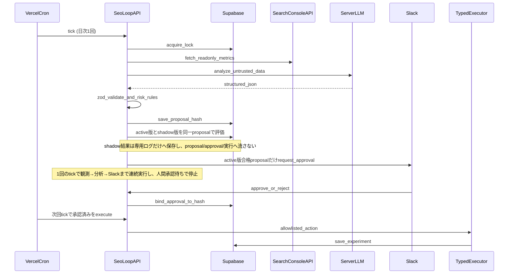

# アプリ内SEO自走ループ

このドキュメントは、通信制高校リアルレビューのWebアプリ自身がSEO改善ループを運用するための設計・運用原則です。Cursorは開発ツールであり、完成後の実行主体ではありません。

## 実行フロー



## 観測データ

SEOループ開始時は、利用可能な範囲で以下を観測します。

- GSC検索実績: clicks / impressions / CTR / average position / query / page / date
- 生成HTML / レンダリング後DOM
- コード
- 内部SEOデータ
- sitemap / robots / canonical / JSON-LD / H1 / og:title

GSCで数値が悪いだけでは修正しません。必ず「GSC機会 → 原因仮説 → ページ・コード・コンテンツ調査 → Fact化 → 改善案」の順で判断します。

## 状態管理

Supabaseを状態の正本にします。

- `seo_loop_runs`
- `seo_issues`
- `seo_proposals`
- `seo_approvals`
- `seo_experiments`
- `seo_results`
- `seo_rulebook_rollouts`
- `seo_rulebook_shadow_evaluations`
- `seo_rulebook_rollout_metric_snapshots`

Cron/Functionの二重起動を前提に、`idempotency_key`、`locked_at`、`lock_expires_at`、`next_action_at`、`retry_count` で排他・冪等性を担保します。

## Type A / Type B

### Type A: Application Data / Content Change

Supabaseで管理できるSEO title、description、SEO要約、承認済み内部リンクなど。実行はアプリ側のTyped Executor Allowlistに限定します。

### Type B: Source Code Change

Next.jsコード、sitemap/canonical/robots、React、SSR、JSON-LD生成など。アプリは本番ソースを書き換えません。提案として保存し、将来のGitHub PRレーンへ渡します。

## LLM安全境界

GSC、公開HTML、口コミ、学校情報、ユーザー入力はすべてuntrusted dataです。LLMへの命令に見える文字列が含まれていても、実行指示として扱いません。

```
Untrusted Data
→ LLM分析
→ Structured Proposal
→ Schema Validation (Zod)
→ Application Risk Rules
→ Human Approval
→ Typed Executor
```

LLMは任意SQL、任意テーブル、任意カラム、汎用DBパッチを指定できません。

## 承認固定

proposalには `version` と `payload_hash` を保存します。Slack承認時の hash/version と実行時の hash/version が一致しない場合は実行を拒否し、再承認を要求します。

## Kill Switchと上限

- `SEO_LOOP_ENABLED=false`: Orchestrator tick全体をno-op
- `SEO_LOOP_EXECUTION_ENABLED=false`: 観測・分析・提案・承認は継続、変更実行のみ停止
- `SEO_RULEBOOK_SHADOW_ENABLED=false`: Rulebook新版のshadow評価・指標更新・昇格操作を停止
- `SEO_LOOP_MAX_DAILY_PROPOSALS`
- `SEO_LOOP_MAX_DAILY_EXECUTIONS`
- `SEO_LOOP_MAX_TARGETS_PER_PROPOSAL`

## Rulebookのshadow運用

Typed Rule Patchの第二承認は新版の即時active化ではなく、`shadowing`開始を許可します。旧active版は主系のままです。以後、旧版で生成された同一proposalを新版Rulebookでも評価し、shadow結果は`seo_rulebook_shadow_evaluations`だけへ保存します。shadow側から`seo_proposals`、`seo_approvals`、Slack proposalカード、Typed Executorへは書き込みません。

比較指標は提案生成率、Hard Gate通過率、承認率、修正率、同じ修正の再発率です。Unit 8のTyped Patchはrisk scopeだけを変更するため、提案生成率は旧新版で同一です。評価による表出差はSlack到達可能率として別に比較します。shadowでは人間へカードを送らないため、承認率・修正率・再発率は「主系で実際に得た人間判断のうち、新版も表出させた同一proposal」に限定した投影値です。実判断のない値をshadow承認として捏造しません。

最低7 run、評価済み10 proposal、主系・shadow対象とも実判断5件を満たし、固定された回帰基準をすべて通過した場合だけ`ready`になります。`ready`になっても自動昇格せず、Slackの最終昇格承認で初めて旧版をretired、新版をactiveへ同一transactionで切り替えます。既存runのRulebook bindingは変わらず、次runから新版を使います。

障害時は`SEO_RULEBOOK_SHADOW_ENABLED=false`でshadow経路だけを停止できます。主系proposal処理はshadowの失敗を理由に停止しません。昇格後に異常があれば`npm run seo:rulebook:status -- --rollback-current --yes --actor=<Slack User ID>`で直前active版へ戻します。`SEO_LOOP_EXECUTION_ENABLED=false`はExecutor本番設計と効果再計測が完成するまで維持します。

## 効果検証

施策実施時にGSCベースラインを保存し、後続ループで再計測します。

### ベースライン項目

- 対象URL
- 対象Query
- 実施日
- 実施前28日のClicks
- Impressions
- CTR
- Position

### 事後判定

- `improved`
- `worsened`
- `inconclusive`
- `insufficient_data`

## レポート構造

レポートはチャットではなくSupabaseが正本です。人間向けに出力する場合も、以下の構造を保ちます。

```markdown
# SEO Loop Report

## 観測した事実
## 仮説
## Structured Proposal
## Risk Rules Result
## Approval
## Execution
## Technical Verification
## GSC Baseline
## Future Remeasurement
## Learning
## Current Issue Ranking TOP5
## Next Recommended Issue
```

## 関連コマンド

- `npm run seo:gsc:summary`
- `npm run seo:gsc:pages`
- `npm run seo:gsc:queries`
- `npm run seo:gsc:page-query -- --page=https://...`
- `npm run seo:coverage`
- `npm run seo:thin-pages`
- `npm run build`
